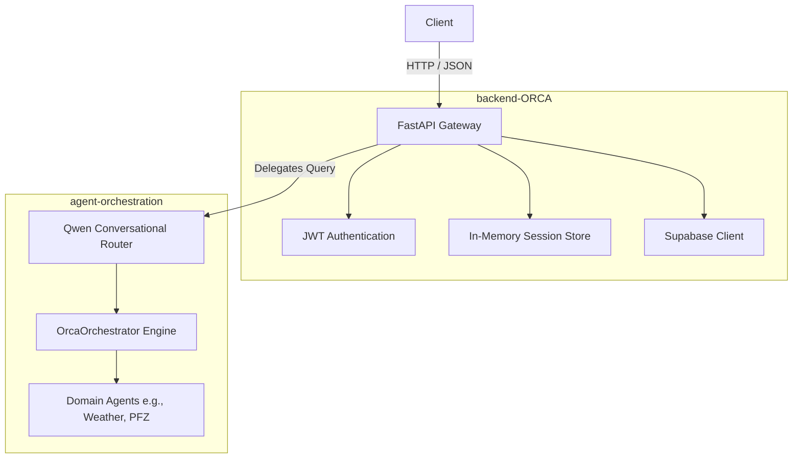

# ORCA Backend (API & Orchestration Layer)

> The API gateway component for the ORCA (Marine Ecosystem Reasoning with Collaborative Agents) platform.

## Role within ORCA

This repository implements the HTTP backend of ORCA.

It is responsible for exposing HTTP endpoints (via FastAPI), handling JWT authentication, managing in-memory sessions, and enforcing rate limits. 

It **does not** implement the core reasoning engine, the conversational AI, or the domain agents. Instead, it delegates all natural language processing and task execution to the external `agent-orchestration` repository.

The strict boundary between the two repositories is:



## API Endpoints

The backend implements the following verified FastAPI routes:

| Method | Endpoint | Purpose | Auth |
| ------ | -------- | ------- | ---- |
| `GET` | `/api/v1/health` | Check API health & uptime | None |
| `POST` | `/api/v1/orca/query` | Process a natural language query | Bearer JWT (Rate Limited) |
| `POST` | `/api/v1/orca/command-center/query` | Prototype command center query | IP Rate Limited (Disabled by default) |
| `GET` | `/api/v1/orca/sessions/{session_id}/history`| Fetch historical queries for a session | Bearer JWT |

## AI / ML Models

**The backend does not implement the marine ML models itself.** 

It initializes the orchestration engine from `agent-orchestration`, which owns the conversational routing (Qwen) and domain-specific ML inference (e.g., XGBoost marine forecasting models used by the domain agents). The `backend-ORCA` repository merely acts as a proxy, passing the user's text query to the Qwen router loaded from the sibling repository.

## Data Sources

### Directly accessed by backend-ORCA

This repository directly communicates with a **Supabase (PostgreSQL)** database to access the following tables:
- `marine_observations` (Using PostgREST and RPC)
- `conversation_state`
- `query_history`

### Accessed indirectly through agent-orchestration

External live data providers for Weather, Ocean states, and Potential Fishing Zones (PFZ) are configured in this repository (via the `.env` file) but are actually executed by the agents inside the `agent-orchestration` repository.

## Session Management

Session state is primarily held in an **in-memory dictionary** (`_IN_MEMORY_SESSIONS` within `services/orca_service.py`). 

- Sessions are not shared across multiple backend instances.
- In-memory state is lost upon process restarts.
- The backend does asynchronously save state to the Supabase `conversation_state` table for durability, but immediate state resolution prioritizes the local memory object.

## Configuration

The backend is configured via a `.env` file. The following environment variables are actually read by the implementation:

| Variable | Purpose | Required | Default |
| -------- | ------- | -------- | ------- |
| `SUPABASE_URL` | Supabase instance URL | Yes | *(empty)* |
| `SUPABASE_KEY` | Supabase service/anon key | Yes | *(empty)* |
| `ORCA_MODEL_BACKEND` | Hardware backend for the LLM (`cuda` or `mlx`) | No | `cuda` |
| `WEATHER_PROVIDER` | External weather API provider | No | `disabled` |
| `OCEAN_PROVIDER` | External ocean API provider | No | `disabled` |
| `PFZ_PROVIDER` | External PFZ API provider | No | `disabled` |
| `WEATHER_DATA_MAX_AGE_HOURS` | Freshness TTL for weather data | No | `6` |
| `OCEAN_DATA_MAX_AGE_HOURS` | Freshness TTL for ocean data | No | `6` |
| `PROVIDER_TIMEOUT_SECONDS` | Timeout for external API calls | No | `2.5` |
| `PROVIDER_MAX_RETRIES` | Max retries for external providers | No | `2` |
| `ORCA_REQUEST_TIMEOUT_SECONDS`| Max duration for a complete ORCA query | No | `15.0` |
| `ORCA_RATE_LIMIT_REQUESTS` | Allowed requests per window | No | `30` |
| `ORCA_RATE_LIMIT_WINDOW_SECONDS`| Rate limit sliding window duration | No | `60` |
| `ORCA_MAX_CONCURRENT_REQUESTS` | Max simultaneous agent executions | No | `4` |
| `ORCA_COMMAND_CENTER_ENABLED` | Enable unauthenticated prototype endpoint | No | `false` |
| `ORCA_COMMAND_CENTER_ORIGIN` | CORS origin for command center | No | `http://localhost:5173` |

## Installation & Setup

### External Repository Dependency

This repository **cannot be installed independently**. It dynamically manipulates the Python `sys.path` to import modules from `agent-orchestration`. 

The directories must be placed exactly side-by-side on the filesystem:

```text
ORCA/
├── backend-ORCA/           <-- This repository
└── agent-orchestration/    <-- Required sibling repository
```

### Known Setup Caveat

The provided `run_api.sh` startup script contains hardcoded developer-specific assumptions:

```bash
source /home/jeffcarter/orca-venv/bin/activate
cd /mnt/w/ORCA
```

If you are not the original developer, you must modify these paths in `run_api.sh` to point to your actual virtual environment and workspace directory, or launch the server manually:

```bash
python3 -m uvicorn backend.main:app --host 0.0.0.0 --port 8000
```

## Testing

There is no automated test suite (e.g., `pytest`) included in this repository. 

Validation is performed via:
- The `/api/v1/health` endpoint.
- Manual API testing (cURL, Postman).
- Extensive terminal observability output printed during agent execution.
